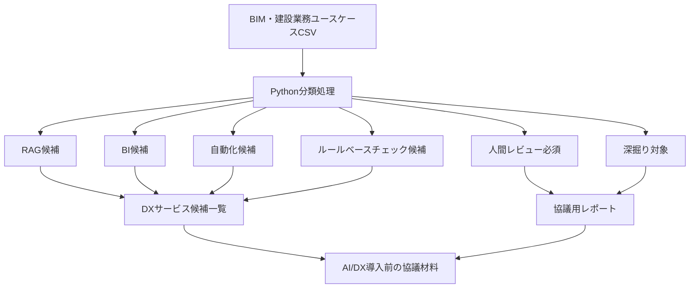

# PoC 2: BIM / Construction AI Use Case Mapper

## BIM・建設業務ユースケース AI/DX分類マッパー

BIM・建設業務のユースケースを、RAG・BI・自動化・ルールベースチェック・人間レビュー・深掘り対象に分類し、AI/DX導入前の協議材料を生成するポートフォリオPoCです。

このリポジトリは、BIM / Construction AI Readiness ポートフォリオの **PoC 2** です。

PoC 1 では、BIMデータの品質評価と AI活用準備度、つまり **AI Readiness** を扱いました。
PoC 2 では、BIM・建設業務のユースケースを整理し、どのような AI/DX 活用パターンに向いているかを分類します。

このPoCでは、実案件データ、顧客データ、社内サービスの詳細情報は使用していません。
ポートフォリオ用途として作成した、架空のBIM・建設業務ユースケースを使用しています。

---

## 主要成果物

このPoCで生成される主な成果物は以下です。

- [AI/DX分類結果](output/ai_use_case_mapping_v001.csv)
- [DXサービス候補一覧](output/dx_service_candidates_v001.csv)
- [深掘り対象一覧](output/deep_dive_targets_v001.csv)
- [協議用レポート](output/discussion_reference_report_v001.md)
- [PoCサマリーレポート](output/ai_use_case_summary_v001.md)
- [pytest検証コード](tests/test_ai_use_case_mapper.py)

---

## 全体フロー



このPoCでは、BIM・建設業務ユースケースを入力として、AI/DX活用パターンに分類し、DXサービス候補一覧や協議用レポートを生成します。
AIが最終判断を行うのではなく、関係者が確認・協議するための判断材料を作成することを目的としています。

---

## 1. 目的

このPoCの目的は、BIM・建設業務のユースケースを、AI/DX導入前に構造化して整理することです。

建設業務やBIM業務では、ある業務に対して、以下のどれが適しているのかが曖昧になりやすいです。

* RAGによる文書参照・説明支援
* BIダッシュボードによる集計・可視化
* 自動化支援
* ルールベースチェック
* 人間レビュー
* 追加ヒアリングや深掘り検討

このPoCでは、架空のBIM・建設業務ユースケースをCSVで整理し、Pythonで分類処理を行い、AI/DX活用候補、深掘り対象、協議用レポートを生成します。

重要なのは、**AIで最終判断を行うことではありません。**
このPoCの目的は、AI/DX導入前に業務を整理し、関係者と協議するための判断材料を作ることです。

---

## 2. PoC 1 との関係

### PoC 1

PoC 1 は、BIMデータそのものを対象にしたPoCです。

主な対象は以下です。

* Revit Schedule TXT
* Doorデータ
* Roomデータ
* BIMデータ品質
* AI Readiness
* ルールベースチェック
* QualityScore
* Fix Guide
* pyRevitによるElementId / UniqueId取得

PoC 1 は、**BIMデータがAI活用に耐えられる状態か**を確認する技術寄りのPoCです。

### PoC 2

PoC 2 は、BIM・建設業務のユースケースを対象にしたPoCです。

主な対象は以下です。

* 業務ユースケース
* AI/DX活用パターン
* RAG候補
* BI候補
* 自動化候補
* ルールベースチェック候補
* 人間レビュー必須業務
* 深掘り対象業務
* 協議用レポート

PoC 2 は、**建設・BIM業務をAI/DX実装前にどう整理するか**を示す、業務設計・AI/DXコンサル寄りのPoCです。

### 整理

```text
PoC 1：BIMデータがAI活用に適しているかを評価する
PoC 2：BIM・建設業務がどのAI/DX活用に適しているかを分類する
```

---

## 3. 基本思想

このPoCでは、次の考え方を基本にしています。

```text
広く浅く整理する
↓
優先度やリスクを見て対象を絞る
↓
必要なものだけ深く検討する
```

すべての業務をいきなりAI化・自動化するのではなく、まずは多くの業務を一覧化し、AI/DX活用パターンごとに分類します。

そのうえで、以下のような業務を深掘り対象にします。

* リスクが高い業務
* 設計判断が必要な業務
* 施工判断が必要な業務
* 法規判断が必要な業務
* 関係者が多い業務
* 正とする資料が不明確な業務
* 判断基準が曖昧な業務
* AI/DXサービス化する前に追加ヒアリングが必要な業務

---

## 4. このPoCで行うこと

このPoCでは、以下を行います。

1. BIM・建設業務の架空ユースケースをCSVで整理する
2. Pythonでユースケースを分類する
3. RAG向きの業務を抽出する
4. BI向きの業務を抽出する
5. 自動化支援向きの業務を抽出する
6. ルールベースチェック向きの業務を抽出する
7. 人間レビューが必要な業務を抽出する
8. 深掘りが必要な業務を抽出する
9. DXサービス候補一覧を生成する
10. 協議用Markdownレポートを生成する
11. Summary Markdownを生成する
12. pytestで出力結果を検証する

---

## 5. このPoCで行わないこと

このPoCでは、以下は行いません。

* 実案件データの使用
* 顧客データの使用
* 社内サービス詳細の使用
* 実際の業務カードの使用
* 法規判断
* 設計判断
* 施工判断
* 安全判断
* 契約判断
* AIによる最終承認
* AIによる専門家判断の代替
* 本番AI診断システムの構築
* 本格的なRAGチャットUIの構築
* BIダッシュボードの実装
* 機械学習モデルの作成

このPoCは、BIM・建設業務をAI/DX導入前に整理するための、ポートフォリオ用PoCです。

---

## 6. フォルダ構成

```text
construction-ai-use-case-mapper/
├─ README.md
├─ input/
│  └─ construction_ai_use_cases_v001.csv
├─ output/
│  ├─ ai_use_case_mapping_v001.csv
│  ├─ human_review_required_use_cases_v001.csv
│  ├─ rag_candidate_use_cases_v001.csv
│  ├─ automation_candidate_use_cases_v001.csv
│  ├─ bi_candidate_use_cases_v001.csv
│  ├─ rule_based_check_candidate_use_cases_v001.csv
│  ├─ dx_service_candidates_v001.csv
│  ├─ deep_dive_targets_v001.csv
│  ├─ discussion_reference_report_v001.md
│  └─ ai_use_case_summary_v001.md
├─ src/
│  ├─ classify_ai_use_cases.py
│  ├─ generate_dx_service_candidates.py
│  └─ generate_ai_use_case_summary.py
├─ docs/
│  ├─ ai_use_case_mapper_policy.md
│  ├─ input_column_definition.md
│  ├─ classification_rules.md
│  ├─ human_review_policy.md
│  ├─ discussion_reference_policy.md
│  ├─ deep_dive_policy.md
│  └─ limitations.md
└─ tests/
   └─ test_ai_use_case_mapper.py
```

---

## 7. 入力データ

入力ファイルは以下です。

```text
input/construction_ai_use_cases_v001.csv
```

このCSVには、架空のBIM・建設業務ユースケースを10件登録しています。

主な列は以下です。

* UseCaseId
* Domain
* WorkPhase
* Role
* UseCaseName
* CurrentTask
* InputData
* OutputData
* CurrentTool
* PainPoint
* DecisionType
* RiskLevel
* RequiresDomainKnowledge
* RequiresDesignJudgment
* RequiresLegalJudgment
* RequiresConstructionJudgment
* DataStructuredness
* Frequency
* CandidateAIUse
* CandidateDXService
* Stakeholders
* DeepDiveRequired
* DeepDiveReason
* DeepDiveQuestion

この入力データは、単なる業務一覧ではなく、AI/DX分類に必要な観点を持たせた構造化データとして設計しています。

---

## 8. 分類カテゴリ

各ユースケースは、以下の観点で分類されます。

### RAGSuitable

RAGによる文書参照、説明支援、ドラフト支援に向いている業務です。

例：

* BIMルール説明
* RFIドラフト支援
* 引き渡し資料確認
* マニュアル・ガイドライン参照

### BISuitable

BIダッシュボード、集計、傾向分析、レポート化に向いている業務です。

例：

* 不具合分類
* 件数集計
* 傾向分析
* 品質状況の可視化

### AutomationSuitable

繰り返し処理や、半自動化に向いている業務です。

例：

* 議事録要約
* 一覧比較
* 定型的な抽出
* 繰り返しのチェック作業

### RuleBasedCheckSuitable

明確なルールに基づくチェックに向いている業務です。

例：

* 未入力チェック
* 命名規則チェック
* COBie項目チェック
* Schedule比較

### HumanReviewRequired

人間レビューが必要な業務です。

以下のような判断が含まれる場合は、人間レビュー必須とします。

* 設計判断
* 施工判断
* 法規判断
* 安全判断
* 契約判断
* 高リスク判断
* 最終承認
* 責任範囲に関わる判断

### DeepDiveRequired

AI/DXサービス化の前に、追加ヒアリングや詳細確認が必要な業務です。

例：

* 正とする資料が不明確
* 関係者が複数いる
* 判断基準が曖昧
* 例外処理が多い
* 責任範囲が不明確
* 実装前に業務フロー確認が必要

### OutOfScope

AI/DX実装対象として扱う前に、スコープ確認が必要な業務です。

例：

* AIが最終判断する
* AIが設計変更を自動承認する
* AIが法規適合を確定する
* AIが安全性を保証する
* AIが専門家判断を代替する

---

## 9. RecommendedApproach

分類結果に基づき、各ユースケースには `RecommendedApproach` が付与されます。

主な値は以下です。

* Rule-based Check + Human Review
* RAG Assistant + Human Review
* BI Dashboard
* Automation Support
* Data Structuring First
* DX Service Candidate Review
* Deep Dive Required
* Out of Scope

これは最終提案ではありません。
関係者と協議するための初期分類です。

---

## 10. Pythonスクリプト

### 10.1 classify_ai_use_cases.py

入力CSVを読み込み、ユースケースを分類します。

実行コマンド：

```powershell
python src/classify_ai_use_cases.py
```

生成ファイル：

```text
output/ai_use_case_mapping_v001.csv
output/human_review_required_use_cases_v001.csv
output/rag_candidate_use_cases_v001.csv
output/automation_candidate_use_cases_v001.csv
output/bi_candidate_use_cases_v001.csv
output/rule_based_check_candidate_use_cases_v001.csv
```

### 10.2 generate_dx_service_candidates.py

分類結果をもとに、DXサービス候補、深掘り対象、協議用レポートを生成します。

実行コマンド：

```powershell
python src/generate_dx_service_candidates.py
```

生成ファイル：

```text
output/dx_service_candidates_v001.csv
output/deep_dive_targets_v001.csv
output/discussion_reference_report_v001.md
```

### 10.3 generate_ai_use_case_summary.py

PoC全体のSummary Markdownを生成します。

実行コマンド：

```powershell
python src/generate_ai_use_case_summary.py
```

生成ファイル：

```text
output/ai_use_case_summary_v001.md
```

---

## 11. 出力ファイル

### ai_use_case_mapping_v001.csv

メインの分類結果です。

主な列は以下です。

* UseCaseId
* UseCaseName
* Domain
* WorkPhase
* RecommendedApproach
* RAGSuitable
* BISuitable
* AutomationSuitable
* RuleBasedCheckSuitable
* HumanReviewRequired
* DeepDiveRequired
* CandidateDXService
* Reason
* RequiredData
* ExpectedOutput
* OutOfScope

### human_review_required_use_cases_v001.csv

人間レビューが必要なユースケースの一覧です。

### rag_candidate_use_cases_v001.csv

RAG支援に向いているユースケースの一覧です。

### automation_candidate_use_cases_v001.csv

自動化支援に向いているユースケースの一覧です。

### bi_candidate_use_cases_v001.csv

BI・ダッシュボード化に向いているユースケースの一覧です。

### rule_based_check_candidate_use_cases_v001.csv

ルールベースチェックに向いているユースケースの一覧です。

### dx_service_candidates_v001.csv

DXサービス候補一覧です。

各ユースケースに対して、候補となるDXサービス、推奨アプローチ、協議ポイントを整理しています。

### deep_dive_targets_v001.csv

深掘り対象のユースケース一覧です。

追加ヒアリング、正とする資料の確認、判断基準の整理、人間レビュー範囲の確認などが必要な業務を抽出しています。

### discussion_reference_report_v001.md

協議用Markdownレポートです。

主な内容は以下です。

* DXサービス候補
* RAG候補
* BI候補
* ルールベースチェック候補
* 自動化候補
* 人間レビュー必須業務
* 深掘り対象業務
* 協議時の確認質問
* 注意事項

### ai_use_case_summary_v001.md

PoC全体の要約レポートです。

主な内容は以下です。

* 全体分類サマリー
* RecommendedApproach別集計
* Domain別集計
* 代表ユースケース
* DXサービス候補サマリー
* 人間レビュー必須業務
* 深掘り対象業務
* ポートフォリオとしての解釈

---

## 12. 実行方法

リポジトリ直下で、以下を順番に実行します。

```powershell
python src/classify_ai_use_cases.py
python src/generate_dx_service_candidates.py
python src/generate_ai_use_case_summary.py
```

その後、pytestを実行します。

```powershell
pytest
```

---

## 13. テスト結果

現在のMVPでは、pytestを通過しています。

```text
17 passed, 1 warning in 2.32s
```

warningは、pandasの将来非推奨に関する通知です。

```text
FutureWarning: DataFrame.applymap has been deprecated. Use DataFrame.map instead.
```

現時点のテスト成功には影響していません。

---

## 14. pytestで確認している内容

pytestでは、以下を検証しています。

* 入力CSVに必須列が存在すること
* 入力CSVに10件のサンプルユースケースが存在すること
* メイン分類結果に必須列が存在すること
* 想定されるoutputファイルが生成されていること
* HighリスクのユースケースがHumanReviewRequiredになること
* 設計・法規・施工判断が必要な業務がHumanReviewRequiredになること
* 想定されるRAG候補が存在すること
* 想定される自動化候補が存在すること
* 想定されるルールベースチェック候補が存在すること
* 想定されるBI候補が存在すること
* DXサービス候補が空でないこと
* 深掘り対象が空でないこと
* 協議用レポートに必要な注意事項が含まれていること
* Summary Markdownに必要な章が含まれていること
* AIが最終判断を行うような表現が含まれていないこと

---

## 15. 重要な方針

このPoCでは、以下を重要方針としています。

1. AI出力は最終判断ではない
2. 高リスク業務や判断を伴う業務では人間レビューを必須とする
3. 深掘り対象は、追加ヒアリングや業務確認の対象とする
4. AI/DX活用パターンは、業務理解を前提に選定する
5. 架空サンプルデータのみを使用する
6. 実案件データ、顧客データ、社内サービス詳細は使用しない

---

## 16. ポートフォリオとして見せたい価値

このPoCでは、以下の力を示すことを目的としています。

* BIM・建設業務の理解
* 曖昧な業務ユースケースの構造化
* AI/DX活用候補の整理
* RAG、BI、自動化、ルールベースチェックの使い分け
* AIで支援できる業務と、人間判断が必要な業務の切り分け
* 深掘りが必要な業務の抽出
* 協議用レポートの生成
* Pythonによる再現可能な処理
* pytestによる出力検証

単にPythonでCSVを処理するだけではなく、BIM・建設業務をAI/DX導入前に整理し、関係者との協議材料に変換することを重視しています。

---

## 17. 現在の進捗

現在のMVP進捗は以下です。

```text
Step 0: 方針決定・設計準備
完了

Step 1: ユースケース入力データ設計
完了

Step 2: 分類ルール設計
完了

Step 3: Python分類処理
完了

Step 4: 派生出力の追加
完了

Step 5: DXサービス候補・協議用レポート生成
完了

Step 6: Summary Markdown生成
完了

Step 7: pytestによる検証
完了
```

テスト結果：

```text
17 passed, 1 warning
```

---

## 18. 今後の拡張案

今後の拡張案は以下です。

* Streamlitビューア作成
* ユースケース件数の追加
* 優先度スコアの追加
* DXサービスロードマップ生成
* RAG用ドキュメント候補のJSONL出力
* BIダッシュボード設計
* Neo4j向けノード・リレーションCSV出力
* Power BIサンプルダッシュボード
* ポートフォリオPDF化
* PoC 1のBIMデータ品質評価結果との接続

---

## 19. まとめ

PoC 2: BIM / Construction AI Use Case Mapper は、BIM・建設業務のユースケースをAI/DX導入前に整理するためのポートフォリオPoCです。

架空の業務ユースケースをもとに、RAG、BI、自動化、ルールベースチェック、人間レビュー、深掘り対象に分類し、DXサービス候補や協議用レポートを生成します。

このPoCは、BIM・建設業務のドメイン知識と、AI/DX実装前の業務整理・構造化をつなぐ実践的なサンプルです。
